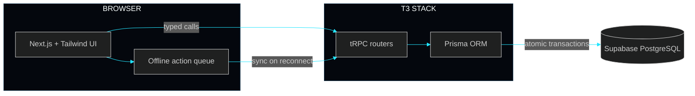

 

I build end-to-end web systems: clean **TypeScript / React** interfaces on top of robust **relational and NoSQL** backends, engineered to stay fast, consistent and secure under load.

 

 

<table>
  <tr>
    <td width="50%" valign="top">
      <!-- TODO: point this at the real ApexPOS repo -->
      
    </td>
    <td width="50%" valign="top">
      <!-- TODO: point this at the DevPulse repo -->
      
    </td>
  </tr>
  <tr>
    <td width="50%" valign="top">
      
    </td>
    <td width="50%" valign="top">
      <!-- TODO: point this at the GraphQL Event Engine repo -->
      
    </td>
  </tr>
</table>

<b>&gt; ApexPOS system architecture (expand)</b>

 

 

  
  

  

  

 

  
  <!-- TODO: replace YOUR-LINKEDIN-USERNAME -->
  
  <!-- TODO: replace YOUR-EMAIL@EXAMPLE.COM -->
  

 

  

